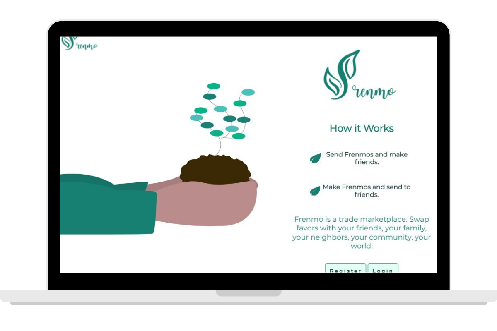
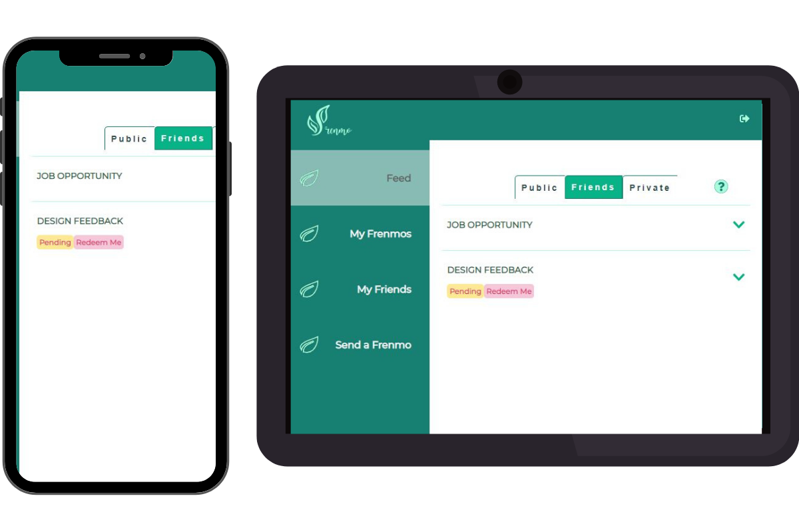
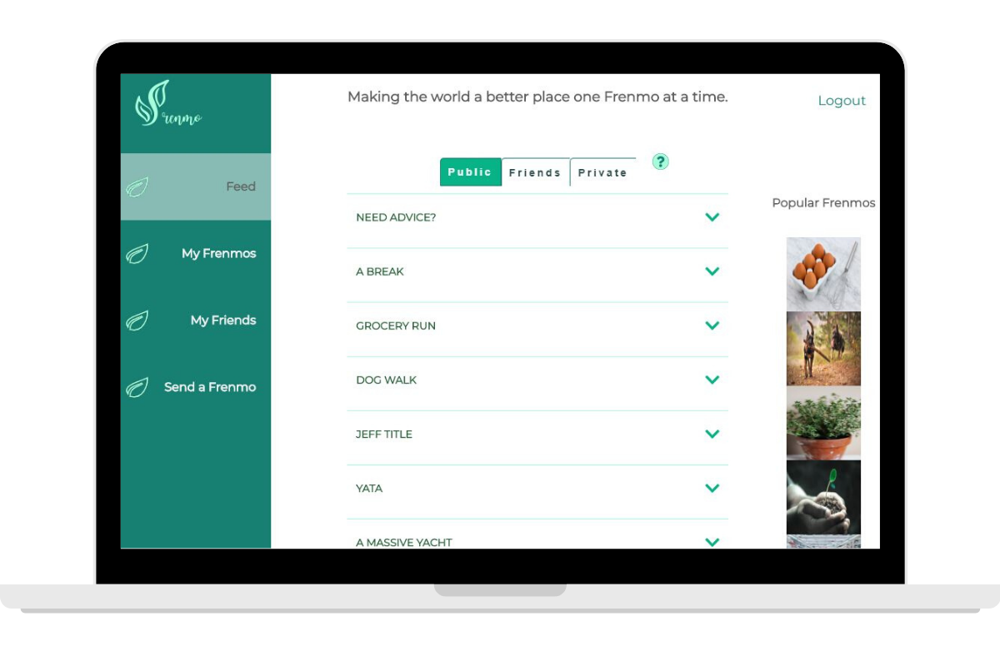
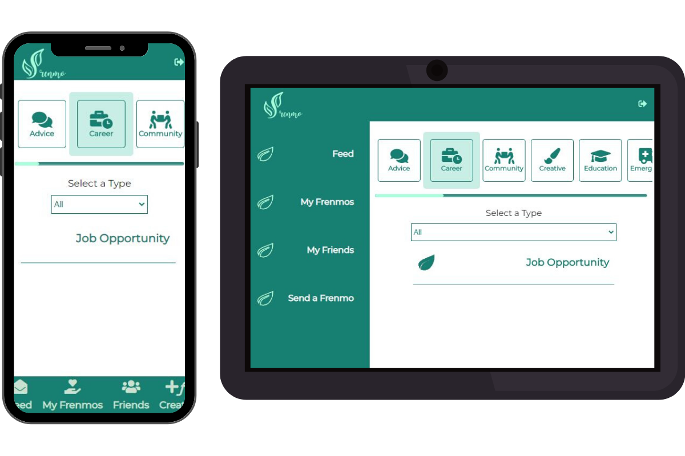
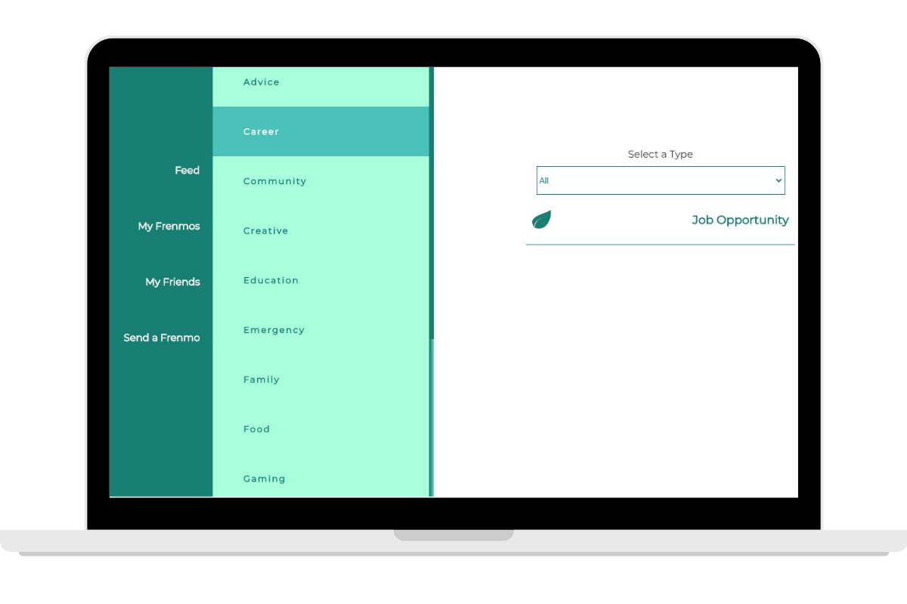
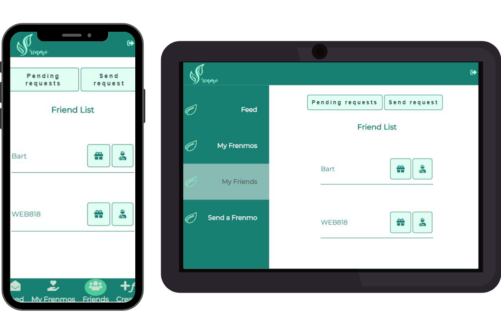
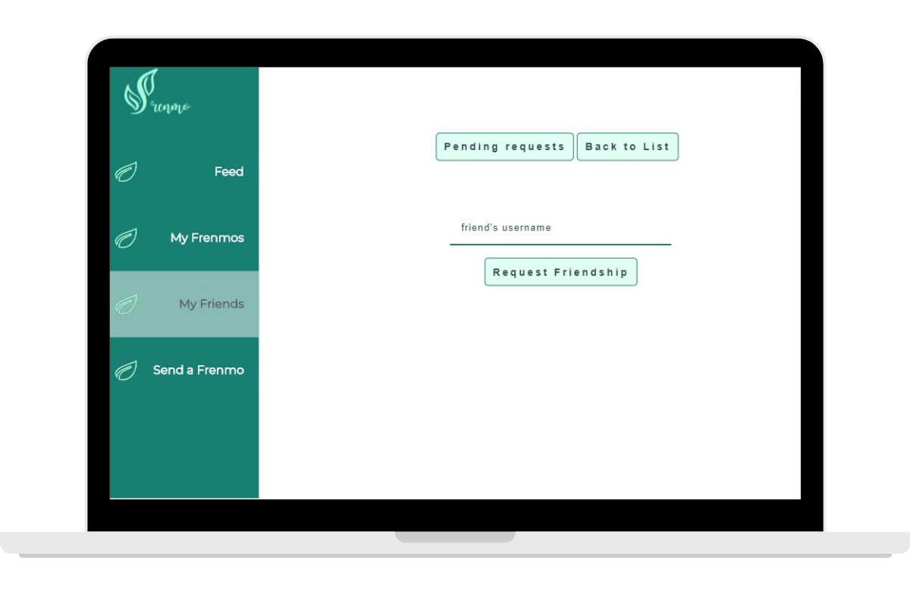
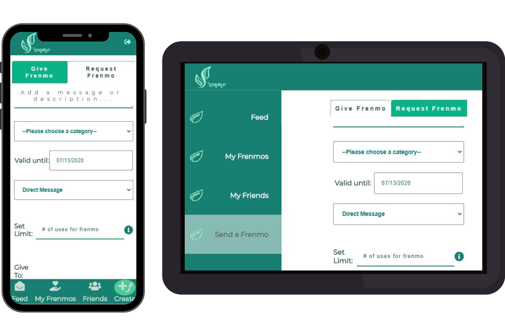
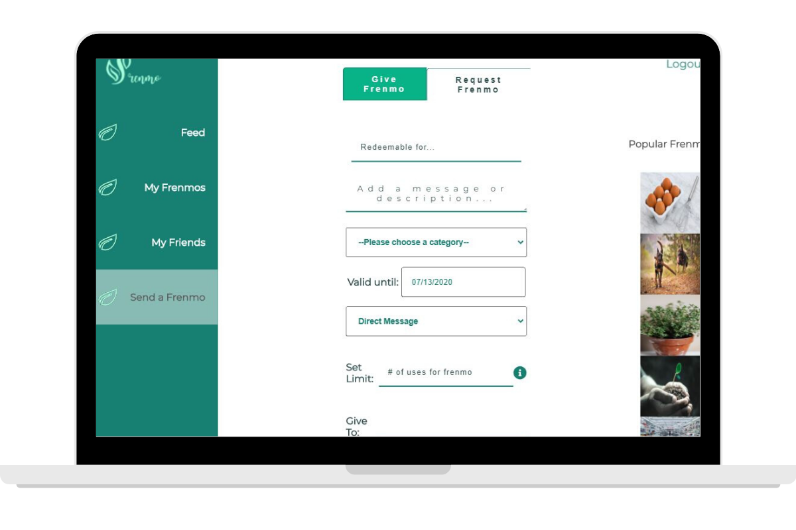

# Frenmo App (Client)

## Team: Jack Pupel, Wendy Bartos, Angel Alicea, Javier Zapien, Dana Zinatbakhsh

## Link: https://frenmo.now.sh/login

## Demo Credentials

Username: WEB818 
Password: Password1!

## Summary

Imagine Venmo, now imagine that but with favors instead of real money.

Frenmo is a site where users can send or request favors from their community and their friends.

## Homepage

## Feed Page

## My Frenmos

## My Friends

## Send Frenmo

## Technologies Used

Front-End: _ReactJS | CSS_

Back-End: _NodeJS | KnexJS | ExpressJS | PostgreSQL_

Testing: _Mocha | Chai_

## See it live!

[Frenmo Live App](https://frenmo-client.vercel.app/ "Demo - see credentials above")

[Frenmo Server (GitHub)](https://github.com/WEB818/frenmo-server "server link")
